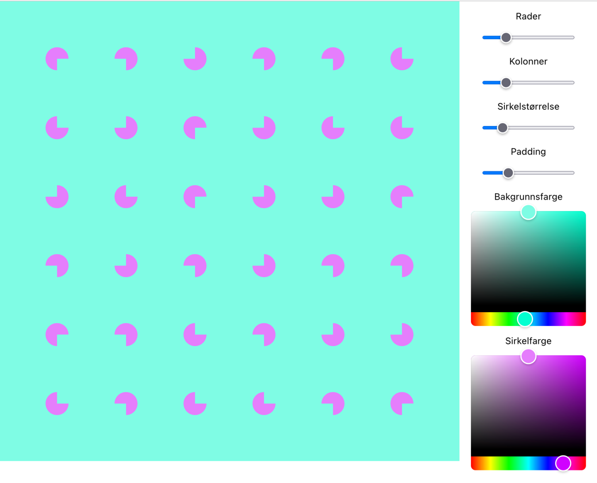
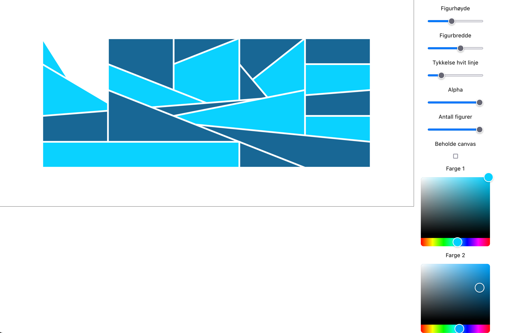

# Generative art workshop

This is a boilerplate (create-react-app with Typescript, react-p5, and some other handy stuff) and a couple exercises
and resources for getting started with generative art.

### Setup

```
npm i
```

### Running

```
npm start
```

## Contents

- [Resources](#resources)
- [Exercises](#exercises)
- [Community](#community)
- [Credits and inspiration](#credits-and-inspiration)

## Resources

- Cheat sheet: https://bmoren.github.io/p5js-cheat-sheet/
- API docs: https://p5js.org/reference/

## Exercises

### Ex 1: Circle design

1. Fill the background with a colour
2. Create an evenly spaced grid across the page
3. At each point in the grid, draw a 75%-filled pie chart shape at 0º, 90º, 180º or 270º rotation

Example result:


### Ex 2: Sol LeWitt Inspired Wall Drawing

1. Using a 6x6 grid of evenly spaced points
1. Connect two random points on the grid; forming a trapezoid with two parallel sides extending down to the baseline
   1. Set the same stroke color as your background
   1. Fill the trapezoid with a colour
   1. Repeat until all grid points are exhausted
1. Layer the shapes by the average Y position of their two grid points so that the shortest shapes is drawn in front of
   the others

Example result:


## Community

- https://github.com/terkelg/awesome-creative-coding

## Credits and inspiration

- https://github.com/mattdesl/workshop-generative-art
- https://dev.to/aspittel/intro-to-generative-art-2hi7
- https://github.com/erdavids/Generative-Art
- Anders Hoff: https://inconvergent.net/
